# Farkle Multiplayer Architecture

## System Architecture Comparison

### Current: Single-Player

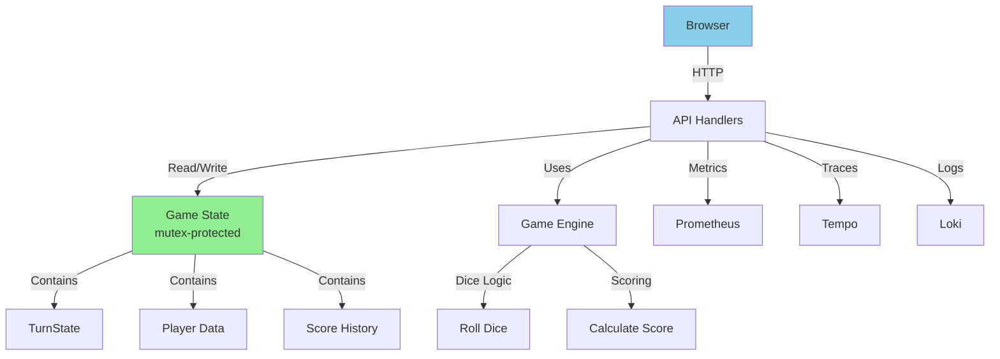

### Proposed: Multiplayer

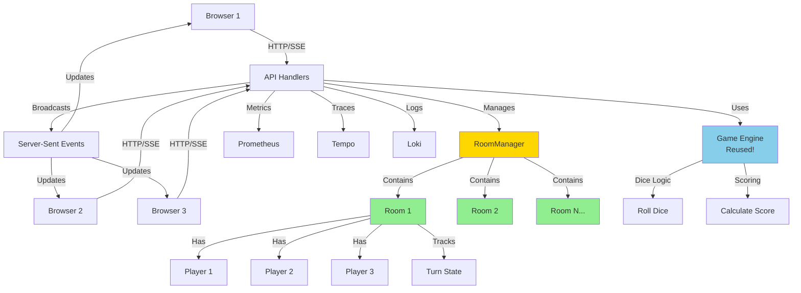

## Data Model Comparison

### Current: Single-Player State

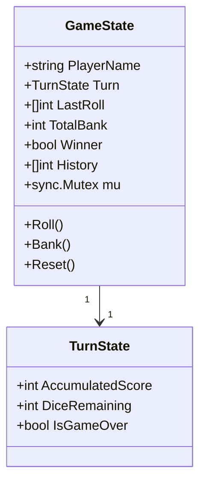

### Proposed: Multiplayer State

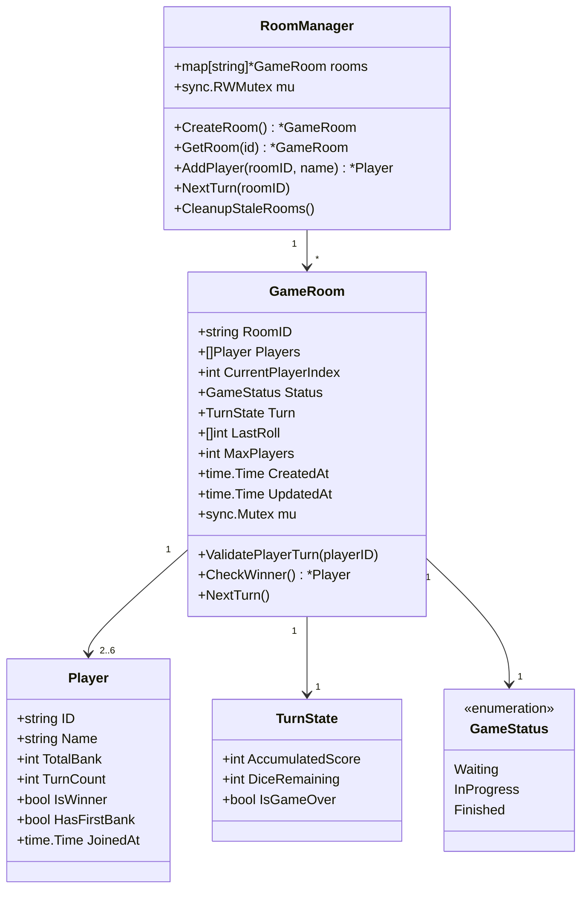

## API Flow: Single-Player vs Multiplayer

### Current: Single-Player Flow

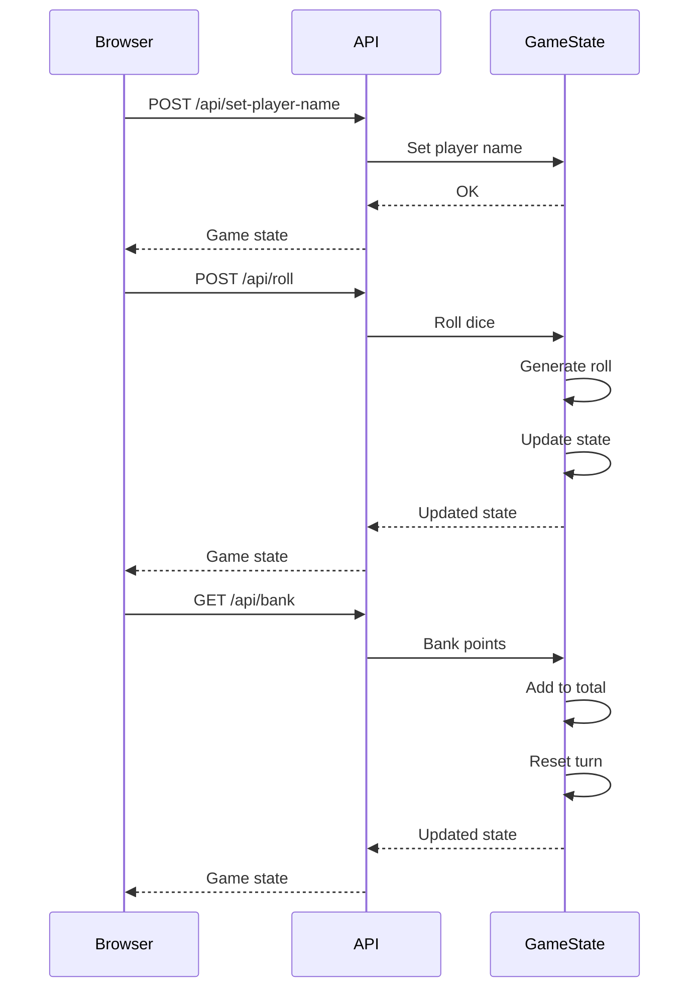

### Proposed: Multiplayer Flow

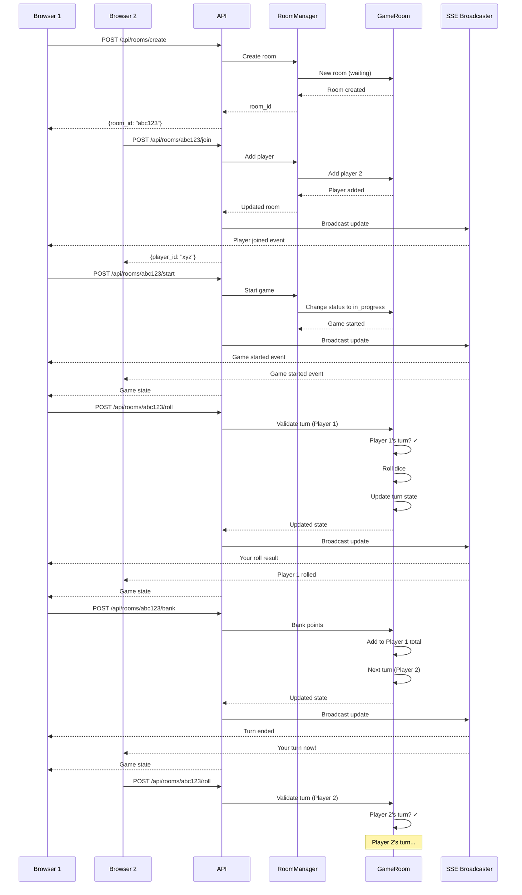

## Real-Time Updates: Options Comparison

### Option A: Polling (Simplest)

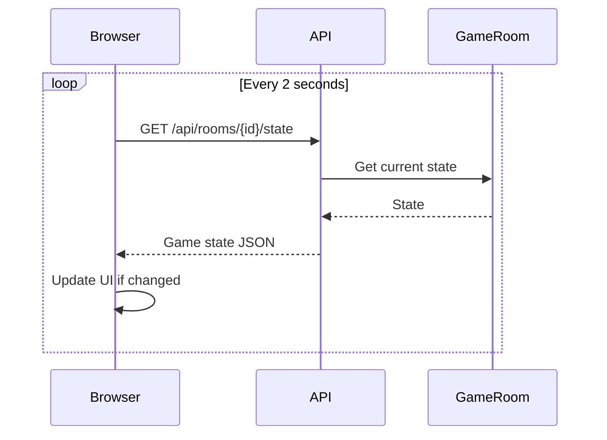

**Pros:**
- Simple to implement
- No server-side state for connections

**Cons:**
- Wastes bandwidth
- 2-second delay for updates
- High server load

### Option B: Server-Sent Events (Recommended)

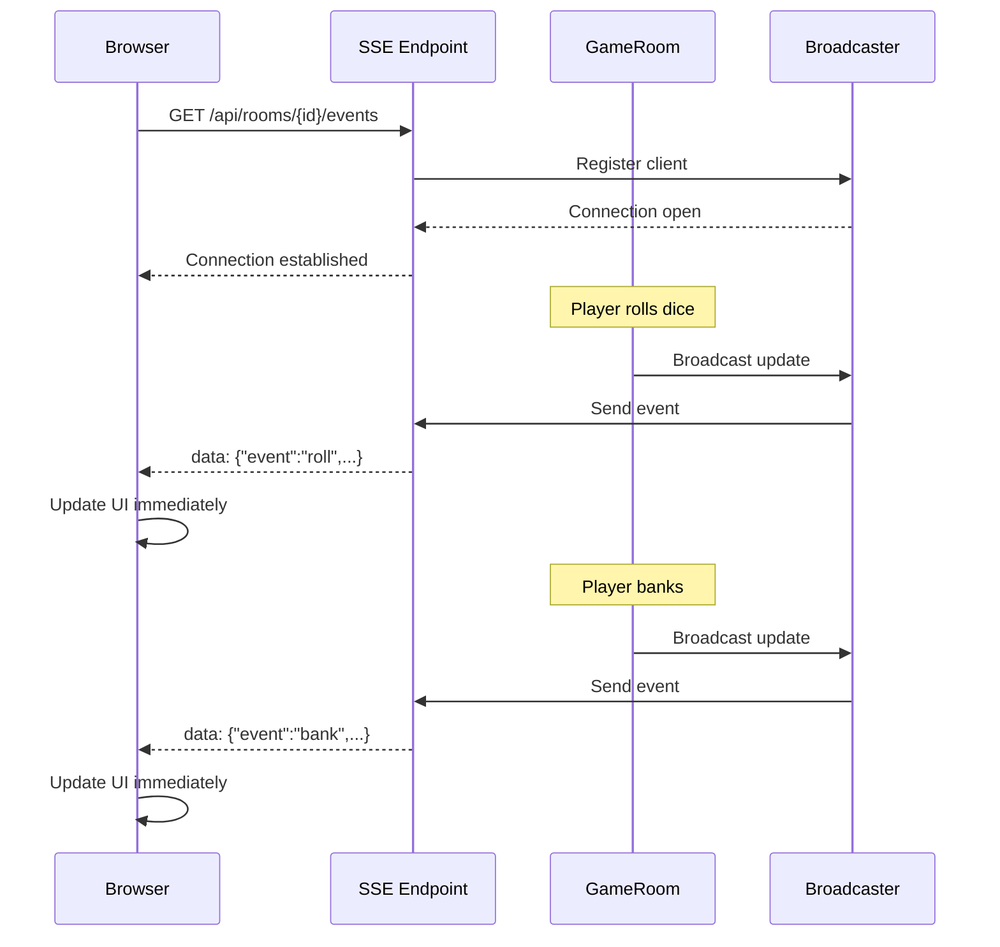

**Pros:**
- Real-time updates
- Server pushes to clients
- HTTP-based (no special ports)

**Cons:**
- One-way (server → client only)
- Need to track open connections

### Option C: WebSockets (Most Powerful)

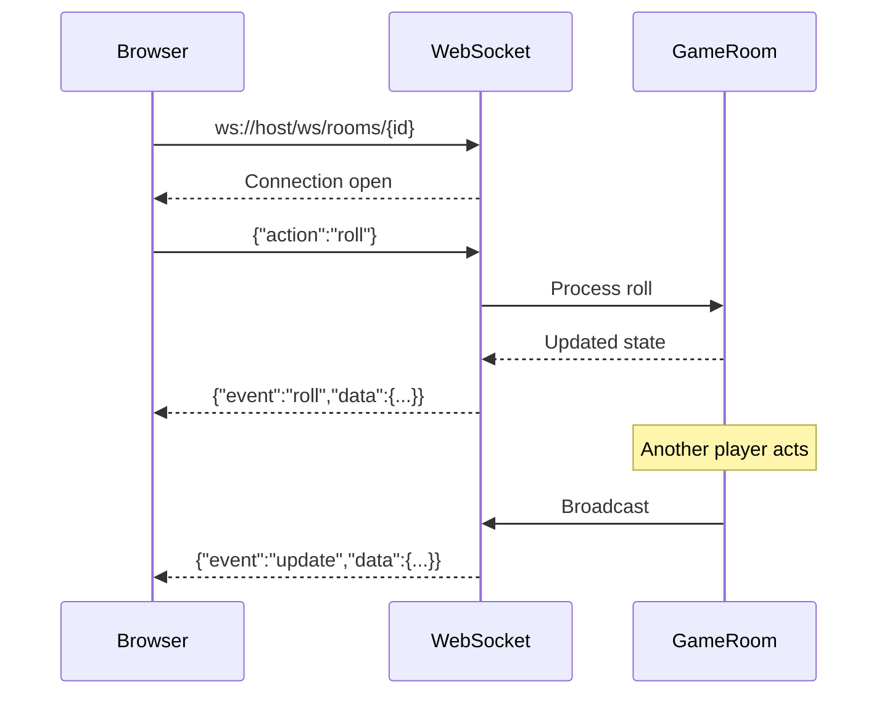

**Pros:**
- Two-way communication
- True real-time
- Can replace HTTP for actions

**Cons:**
- More complex
- Requires WebSocket library
- Need connection management

## Room Lifecycle

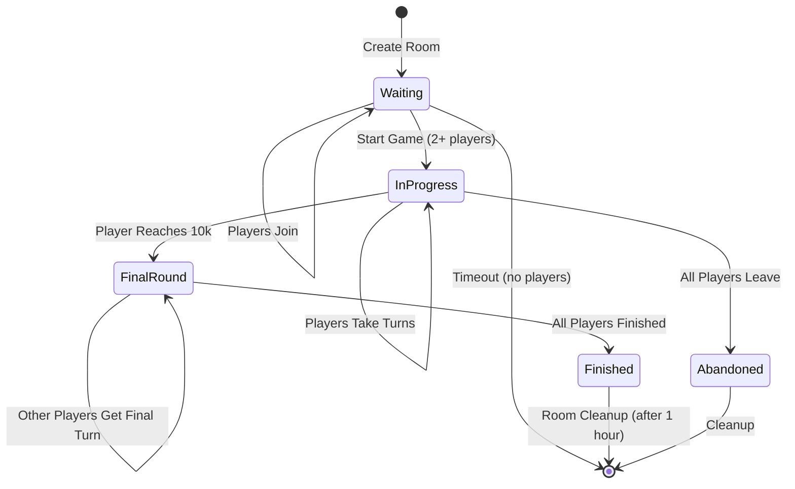

## Turn Rotation Logic

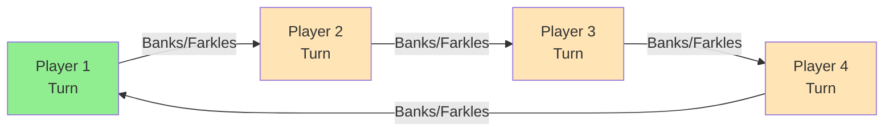

**Turn End Conditions:**
1. Player banks points → Next player
2. Player farkles → Next player
3. Player manually ends turn → Next player

**Turn Validation:**
```
if currentPlayerIndex != playerRequestingAction:
    return error("Not your turn!")
```

## Deployment Options

### Option 1: Single Instance

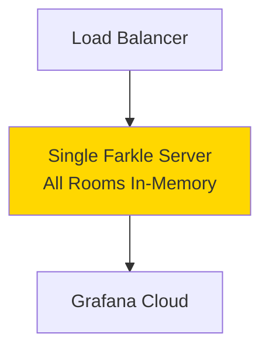

**Pros:** Simple
**Cons:** No scaling, rooms lost on restart

### Option 2: Stateful Instances (Sticky Sessions)

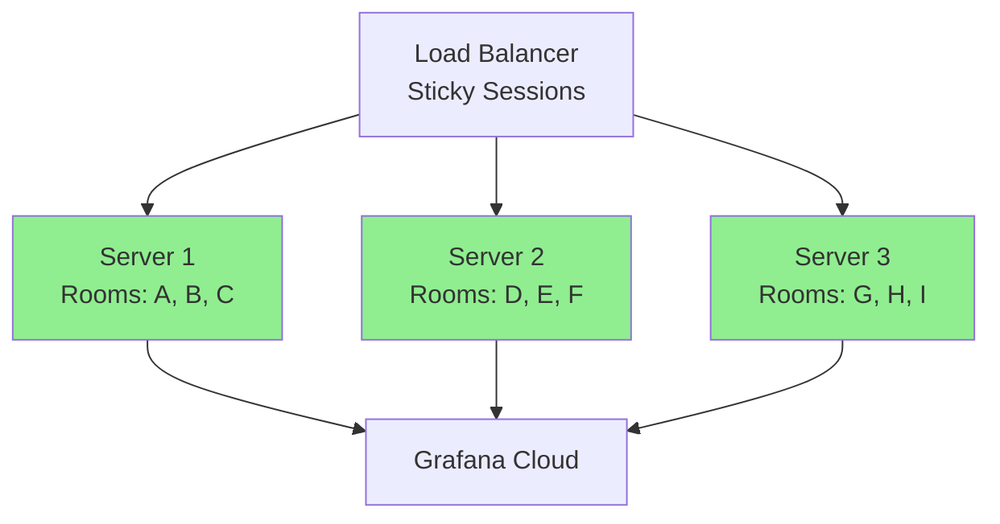

**Pros:** Can scale
**Cons:** Need sticky sessions, room loss on restart

### Option 3: Shared State (Redis/Database)

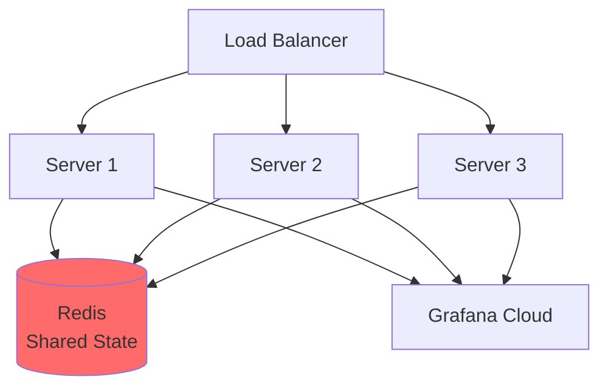

**Pros:** Scalable, persistent
**Cons:** More complex, added latency

**Recommendation for MVP:** Option 1 (single instance)

## Summary

The multiplayer architecture:
- Reuses **80% of existing game logic** (dice, scoring)
- Adds **room management** for multiple games
- Implements **turn-based coordination** between players
- Uses **real-time updates** (SSE recommended)
- Maintains **same observability** (metrics, traces, logs)

The single-player version remains **completely intact** - multiplayer is a separate implementation that shares the core game engine.
